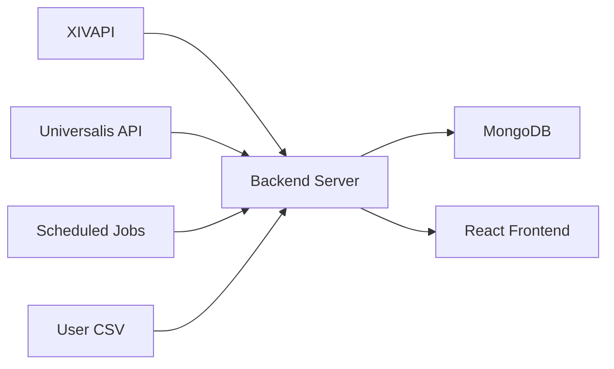

# 🌸 FF14 Gillionaire Dashboard

A soft pastel pink dashboard that analyzes FF14 item profitability by comparing vendor prices with marketboard prices to identify the most profitable items to sell.

## Features

### Core Functionality
- **Item Profitability Analysis**: Compare vendor prices with marketboard prices across European data centers
- **Real-time Market Data**: Hourly updates from Universalis API
- **Beautiful Pastel Pink UI**: Soft, pleasant design optimized for long viewing sessions
- **Data Visualizations**: Charts showing profit distribution and market trends
- **Item Details**: In-depth information including listings and price history

### Data Center Support
- **Chaos Data Center**: Cerberus, Louisoix, Moogle
- **Light Data Center**: Omega, Phantom, Ragnarok
- **Omega Data Center**: Sagittarius, Spriggan
- **Full European Coverage**: Complete regional market analysis

### User Experience
- **Responsive Design**: Works seamlessly on desktop and mobile devices
- **Interactive Filtering**: Sort and filter items by various criteria
- **Real-time Updates**: Automatic data refresh with manual refresh options
- **Performance Optimized**: Fast loading and smooth interactions

## Technology Stack

### Backend Architecture
- **Node.js** with Express.js for robust API server
- **MongoDB** for efficient data caching and storage
- **XIVAPI** for comprehensive vendor prices and item details
- **Universalis API** for real-time marketboard data
- **Scheduled Jobs** for automatic hourly data updates

### Frontend Technology
- **React 18** with modern hooks and state management
- **Material-UI** with custom pastel pink theme customization
- **Recharts** for interactive data visualization
- **Axios** for reliable API communication
- **React Router** for seamless navigation

### System Integration


## Installation & Setup

### Prerequisites
- Node.js 16+ installed on your system
- MongoDB installed and running locally
- Your Item.csv file in the project root directory
- Stable internet connection for API access

### Quick Installation

1. **Clone the Repository**
   ```bash
   git clone <repository-url>
   cd FF14Gillionaire
   ```

2. **Install All Dependencies**
   ```bash
   npm run install-all
   ```

3. **Configure Environment**
   ```bash
   cd server
   cp .env.example .env
   ```
   
   Edit the `.env` file with your configuration:
   ```env
   PORT=5000
   MONGODB_URI=mongodb://localhost:27017/ff14-gillionaire
   ```

4. **Start the Application**
   ```bash
   cd ..
   npm start
   ```

   This launches both backend server (port 5000) and frontend (port 3000).

## Usage Guide

### Initial Setup

#### Data Import
1. **Prepare Your Item CSV**
   - Ensure your `Item.csv` file is in the project root
   - Required columns: `itemID`, `itemName`, `tradeable` (boolean)
   - The dashboard automatically detects and imports valid CSV files

2. **Initialize Market Data**
   - Navigate to Data Status page (`/status`)
   - Click "Force Refresh All Data" for initial data fetch
   - **Important**: This process may take several minutes for complete data loading

#### Daily Usage Workflow

1. **Select Your Data Center**
   - Choose from Chaos, Light, or Omega data centers
   - Each data center shows region-specific market data
   - Switch between data centers for comparative analysis

2. **Configure Profit Filters**
   - Set minimum profit margin thresholds
   - Adjust filtering criteria for targeted searches
   - Save preferences for future sessions

3. **Analyze Profitable Items**
   - Browse sorted list of profitable items
   - View detailed information for each item
   - Compare across different data centers

### Advanced Features

#### Item Analysis
- **Detailed View**: Click any item for comprehensive information
- **Price History**: Track market trends over time
- **Current Listings**: View active marketboard listings
- **Cross-Data Center**: Compare prices across regions

#### Data Management
- **Status Monitoring**: Check last update times and data freshness
- **Manual Refresh**: Force update specific items or all data
- **Export Data**: Download analysis results for external use

## API Documentation

### Item Management Endpoints
- `GET /api/items` - Retrieve all items with pagination support
- `GET /api/items/:id` - Get specific item details and data
- `GET /api/items/profitable/:dataCenter` - Filter profitable items by region
- `GET /api/items/search/:query` - Search items by name or criteria

### Market Data Endpoints
- `GET /api/market/:dataCenter/:itemId` - Retrieve market data for specific item
- `POST /api/market/refresh/:dataCenter/:itemId` - Force refresh market data
- `GET /api/market/summary/:dataCenter` - Get market overview and statistics

### Data Management Endpoints
- `GET /api/data/status` - Check system status and data freshness
- `POST /api/data/initialize` - Initialize system with all data
- `POST /api/data/force-refresh` - Force refresh all market data

## Configuration Options

### Environment Variables

| Variable | Description | Default Value |
|----------|-------------|---------------|
| `PORT` | Server port for backend API | `5000` |
| `MONGODB_URI` | MongoDB connection string | `mongodb://localhost:27017/ff14-gillionaire` |
| `XIVAPI_KEY` | XIVAPI authentication key (if required) | - |
| `UNIVERSALIS_API_KEY` | Universalis API key (if required) | - |
| `RATE_LIMIT_WINDOW_MS` | API rate limiting window | `900000` |
| `RATE_LIMIT_MAX_REQUESTS` | Maximum requests per window | `100` |

### Data Update Configuration
- **Market Data**: Automatically updated every hour
- **Profitability Calculations**: Recalculated after each market update
- **Manual Refresh**: Available through Data Status page
- **Error Handling**: Automatic retry mechanisms for failed updates

## Data Sources & Integration

### Primary APIs
- **XIVAPI**: Comprehensive FF14 item database with vendor prices
- **Universalis API**: Real-time marketboard data from player transactions
- **Custom CSV File**: User-provided item lists with tradeability information

### Data Processing
- **Automated Collection**: Scheduled jobs fetch data regularly
- **Data Validation**: Cross-reference multiple sources for accuracy
- **Error Correction**: Handle API failures and data inconsistencies
- **Performance Optimization**: Intelligent caching and request batching

## Troubleshooting Guide

### Common Issues

#### "No data available" Error
**Symptoms**: Dashboard shows empty or error states
**Solutions**:
- Verify your Item.csv file is properly formatted
- Check that MongoDB is running and accessible
- Try initializing data from the Data Status page
- Confirm CSV file has required columns: `itemID`, `itemName`, `tradeable`

#### Slow Loading Times
**Symptoms**: Pages take long time to load or respond
**Solutions**:
- Initial data loading can take several minutes - this is normal
- Market data refreshes are rate-limited to respect API limits
- Consider running refreshes during off-peak hours
- Check your internet connection stability

#### API Connection Errors
**Symptoms**: Error messages about API failures
**Solutions**:
- Verify internet connection is stable
- Check if API services are operational
- Review server console logs for detailed error information
- Try restarting the application

#### Data Accuracy Issues
**Symptoms**: Market prices seem incorrect or outdated
**Solutions**:
- Check data freshness on Data Status page
- Force refresh specific items if needed
- Verify you're looking at the correct data center
- Understand that market prices fluctuate frequently

### Performance Optimization

#### Database Performance
- **Index Optimization**: MongoDB indexes for faster queries
- **Connection Pooling**: Efficient database connection management
- **Caching Strategy**: Redis integration for frequently accessed data
- **Query Optimization**: Efficient database query patterns

#### Frontend Performance
- **Lazy Loading**: Load data only when needed
- **Code Splitting**: Reduce initial bundle size
- **Image Optimization**: Compress and optimize visual assets
- **Caching Strategy**: Browser caching for static assets

## Development & Contributing

### Development Setup
1. **Fork the Repository**: Create your own copy for development
2. **Create Feature Branch**: `git checkout -b feature-name`
3. **Make Changes**: Implement your features or fixes
4. **Test Thoroughly**: Ensure compatibility across browsers
5. **Submit Pull Request**: Detailed description of changes

### Code Standards
- **JavaScript**: ES6+ standards with proper error handling
- **React**: Modern hooks patterns and component organization
- **CSS**: Material-UI theming with consistent styling
- **Documentation**: Update README and inline comments

## License & Disclaimer

### License
This project is licensed under the MIT License - see the [LICENSE](../../../LICENSE) file for complete details.

### Important Disclaimer
**⚠️ Educational Use Only**: This tool is for informational purposes only.
- Market prices are subject to rapid change
- Past performance does not guarantee future results
- Always conduct your own research before making investment decisions
- FF14 market conditions can change without notice

## Version History

### v1.0.0 - Initial Release
- Basic profitability analysis functionality
- European data center support
- Pastel pink theme implementation
- Core data visualization charts
- Item details and history tracking

### Future Roadmap
- **Advanced Analytics**: AI-powered market predictions
- **Mobile Application**: Native iOS and Android apps
- **Extended Data**: More regions and item categories
- **Social Features**: Community insights and sharing
- **Automated Trading**: Bot integration for power users

---

**Support & Community**: For issues, questions, or contributions, please refer to the project repository and issue tracker. This dashboard represents a sophisticated approach to FF14 market analysis with emphasis on user experience and data accuracy.
