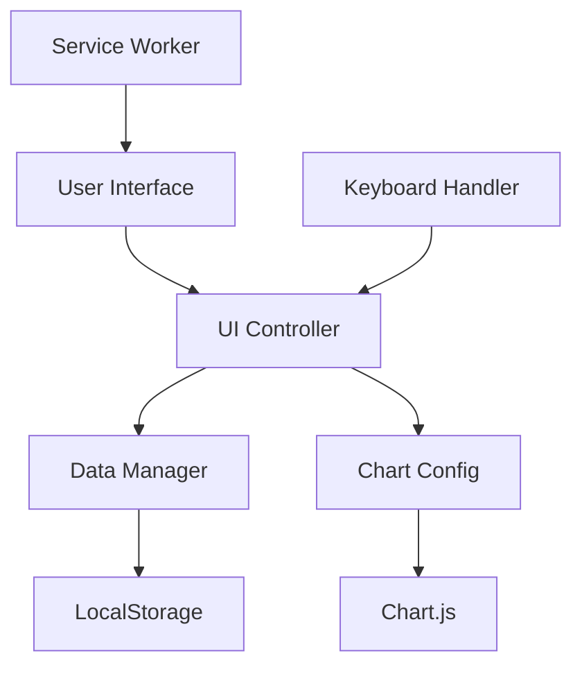

# Money Tracker

A sophisticated web-based expense tracking dashboard designed for personal financial management. Features an intuitive interface with comprehensive data visualization, local storage persistence, and responsive design for seamless cross-device experience.

## Overview

Money Tracker provides a complete solution for personal expense management with advanced features and privacy-first architecture.

### Core Philosophy
- **Real-time expense tracking** with immediate visual feedback
- **Advanced data visualization** using Chart.js for spending insights
- **Privacy-first architecture** with all data stored locally
- **Professional UI/UX** with responsive design and keyboard shortcuts
- **Multi-currency support** with customizable settings

## Key Features

### Expense Management
- **Add Transactions**: Quick and easy expense entry with comprehensive forms
- **Edit & Delete**: Full CRUD operations for transaction management
- **Categorization**: Organize expenses by custom categories
- **Date Management**: Track expenses by specific dates and periods
- **Description Fields**: Detailed notes for each transaction

### Budget Tracking
- **Monthly Budgets**: Set and monitor monthly spending limits
- **Visual Progress**: Color-coded progress indicators
- **Budget Analysis**: Compare actual spending vs. budgeted amounts
- **Flexible Settings**: Adjustable budget periods and categories
- **Alert System**: Visual warnings when approaching limits

### Data Visualization
- **Category Breakdown**: Interactive doughnut chart showing spending distribution
- **Monthly Trends**: Bar chart displaying monthly spending patterns over time
- **30-Day Trend**: Line chart with moving average for recent spending analysis
- **Budget vs. Actual**: Donut chart comparing budget to actual spending

### Advanced Features
- **Multi-currency Support**: 20+ major currencies plus custom options
- **Keyboard Shortcuts**: Productivity-enhancing keyboard controls
- **Dark/Light Mode**: Toggle between themes for comfortable usage
- **Import/Export**: Support for both JSON and CSV formats
- **Data Backup**: Easy backup and restore functionality

## Technology Stack

### Frontend Architecture
- **Vanilla JavaScript (ES6+)**: Modern, framework-independent development
- **HTML5**: Semantic markup and modern web standards
- **CSS3**: Advanced styling with animations and responsive design
- **Chart.js 4.x**: Powerful, interactive data visualization
- **Font Awesome 6.4**: Comprehensive icon library

### Storage & Performance
- **Browser LocalStorage**: Client-side data persistence for privacy
- **Service Worker**: Offline functionality and caching
- **Lazy Loading**: Optimized performance for large datasets
- **Responsive Design**: Mobile-first approach with CSS Grid/Flexbox

### Development Tools


## Installation & Setup

### Prerequisites
- Modern web browser (Chrome 60+, Firefox 55+, Safari 12+, Edge 79+)
- No additional software or server requirements
- JavaScript enabled in browser

### Quick Start

1. **Download or Clone**
   ```bash
   git clone https://github.com/yourusername/money-tracker.git
   cd money-tracker
   ```

2. **Open Application**
   ```bash
   # Simply open index.html in your preferred browser
   open index.html
   ```

3. **Start Tracking**: Begin adding expenses immediately

### Development Setup

For local development with live reload:
```bash
# Using Python 3
python -m http.server 8000

# Using Node.js (if available)
npx serve .

# Navigate to http://localhost:8000
```

## Usage Guide

### Getting Started

#### Initial Configuration
1. **Set Your Budget**: Configure monthly budget in settings
2. **Choose Currency**: Select from 20+ supported currencies
3. **Configure Categories**: Customize expense categories as needed
4. **Set Preferences**: Configure themes and notification settings

#### Daily Usage Workflow
1. **Add Expenses**: Use the quick add form for expense entry
2. **Review Analytics**: Monitor spending patterns through charts
3. **Check Budget**: Monitor progress against budget limits
4. **Export Data**: Regular backup of financial data

### Keyboard Shortcuts

| Shortcut | Action |
|----------|--------|
| `Ctrl+N` | Add new expense |
| `Ctrl+E` | Export data |
| `Ctrl+I` | Import data |
| `Ctrl+R` | Refresh dashboard |
| `Ctrl+L` | Clear all data (with confirmation) |
| `Esc` | Close active modal |
| `Shift+?` | Show keyboard shortcuts help |

### Transaction Management

#### Adding Expenses
- **Quick Entry**: Use the main form for fast expense addition
- **Required Fields**: Amount, category, description, and date
- **Optional Fields**: Additional notes and tags
- **Validation**: Automatic format checking and error prevention

#### Managing Expenses
- **Edit Transactions**: Click edit icon to modify details
- **Delete Records**: Remove unwanted expenses with confirmation
- **Bulk Operations**: Select multiple items for batch actions
- **Search & Filter**: Find specific transactions quickly

### Budget Configuration

#### Setting Up Budgets
1. **Access Budget Settings**: Click "Edit Budget" button
2. **Enter Amount**: Set monthly budget in preferred currency
3. **Category Allocation**: Distribute budget across categories
4. **Save Changes**: Apply budget settings immediately

#### Budget Monitoring
- **Visual Indicators**: Progress bars show remaining budget
- **Percentage Display**: Shows budget usage percentage
- **Color Coding**: Green (safe), yellow (warning), red (over budget)
- **Alert System**: Notifications when approaching limits

## Data Management

### Import Functionality
- **CSV Import**: Upload CSV files with expense data
- **JSON Import**: Import previously exported backup files
- **Format Validation**: Automatic data format checking
- **Error Reporting**: Detailed import error messages
- **Duplicate Handling**: Options for managing duplicate entries

### Export Capabilities
- **CSV Export**: Download data in spreadsheet-compatible format
- **JSON Export**: Complete data backup with all settings
- **Date Range Export**: Export specific time periods
- **Category Export**: Export filtered data by category
- **Automated Backups**: Regular backup reminders

### Data Privacy & Security
- **Local-Only Storage**: No data transmission to external servers
- **No Third-Party Tracking**: Complete user privacy
- **Input Validation**: Comprehensive client-side validation
- **Secure Defaults**: Safe default configurations

## Configuration & Customization

### Currency Settings
- **Major Currencies**: USD, EUR, GBP, JPY, CAD, AUD, CHF, CNY, INR, KRW
- **Custom Currency**: Add your own currency with symbol
- **Symbol Positioning**: Prefix or suffix currency placement
- **Exchange Rates**: Manual rate updates for custom currencies

### Category Management
- **Default Categories**: Food, Transport, Entertainment, Shopping, Bills, Health, Education, Other
- **Add Categories**: Custom categories for specific needs
- **Color Coding**: Visual distinction for categories
- **Category Icons**: Assign icons for better visual organization

### Theme Customization
- **Color Schemes**: Modify CSS variables for custom themes
- **Dark Mode**: Eye-friendly mode for low-light environments
- **Light Mode**: Bright theme for well-lit conditions
- **High Contrast**: Accessibility mode for visual impairments

## Performance & Security

### Performance Features
- **Lightweight Design**: Minimal footprint for fast loading
- **Optimized Charts**: Efficient rendering and updates
- **Caching Strategy**: Service worker for offline functionality
- **Responsive Design**: Optimized for all device sizes

### Security Considerations
- **Data Privacy**: All data stored locally, never transmitted
- **Input Validation**: Comprehensive client-side validation
- **XSS Protection**: HTML escaping for user inputs
- **Secure Storage**: Safe LocalStorage implementation

## Browser Compatibility

| Browser | Minimum Version | Features Supported |
|---------|----------------|-------------------|
| Chrome | 60+ | Full feature support |
| Firefox | 55+ | Full feature support |
| Safari | 12+ | Full feature support |
| Edge | 79+ | Full feature support |

## Deployment Options

### Static Site Hosting
- **GitHub Pages**: Free hosting with custom domain support
- **Netlify**: Continuous deployment with form handling
- **Vercel**: Performance-optimized hosting with analytics
- **Surge.sh**: Simple deployment for testing

### Deployment Scripts
```bash
# Deploy to GitHub Pages
./deploy.sh        # macOS/Linux
deploy.bat          # Windows

# Deploy to Vercel
./deploy-vercel.sh  # macOS/Linux
deploy-vercel.bat   # Windows
```

## Troubleshooting

### Common Issues

#### Data Not Saving
**Symptoms**: Expenses disappear after page refresh
**Solutions**:
- Check browser LocalStorage permissions
- Verify JavaScript is enabled
- Try different browser
- Clear browser cache and reload

#### Charts Not Loading
**Symptoms**: Data visualization displays errors or blank areas
**Solutions**:
- Verify JavaScript is enabled
- Check browser console for error messages
- Ensure Chart.js library loads properly
- Try refreshing the page

#### Mobile Display Issues
**Symptoms**: Layout problems on mobile devices
**Solutions**:
- Ensure browser zoom is at 100%
- Check responsive design in browser dev tools
- Clear browser cache
- Try different mobile browser

#### Import/Export Problems
**Symptoms**: Data upload or download fails
**Solutions**:
- Verify file format (CSV/JSON)
- Check file size limits
- Ensure proper file encoding (UTF-8)
- Check browser download permissions

### Performance Optimization

#### Large Dataset Handling
- **Pagination**: Display data in manageable chunks
- **Virtual Scrolling**: Render only visible items
- **Data Aggregation**: Pre-compute chart data
- **Lazy Loading**: Load data on demand

#### Memory Management
- **Event Cleanup**: Remove unused event listeners
- **Chart Optimization**: Destroy old chart instances
- **Data Purging**: Option to remove old data
- **Cache Management**: Intelligent data caching

## Contributing

### Development Workflow
1. **Fork Repository**: Create your own development copy
2. **Create Feature Branch**: `git checkout -b feature-name`
3. **Make Changes**: Implement features or fixes
4. **Test Thoroughly**: Ensure cross-browser compatibility
5. **Submit Pull Request**: Detailed description and testing

### Code Standards
- **JavaScript**: ES6+ standards with proper error handling
- **CSS**: Organized with clear commenting and responsive design
- **HTML**: Semantic markup with accessibility considerations
- **Documentation**: Update README and inline comments

### Issue Reporting
- Use GitHub Issues with clear bug reports
- Include browser version and reproduction steps
- Provide screenshots for UI-related issues
- Suggest potential fixes if possible

## Version History

### v2.0 - Major Updates
- Multi-currency support with 20+ currencies
- Dark mode and theme customization
- Enhanced charts with new visualization types
- Performance optimizations and caching
- Improved mobile experience

### v1.5 - Feature Enhancements
- CSV import/export functionality
- Improved UI with better navigation
- Performance optimizations
- Additional keyboard shortcuts

### v1.0 - Initial Release
- Core expense tracking functionality
- Basic budget management
- Simple data visualization
- Local storage implementation

## Future Roadmap

### Planned Enhancements
- **Advanced Reporting**: Custom date ranges and detailed reports
- **Recurring Transactions**: Automated expense entries
- **Spending Goals**: Target-based savings and spending goals
- **AI Insights**: Powered spending pattern analysis
- **Mobile Application**: React Native iOS/Android apps
- **Multi-User Support**: Family budget management
- **Advanced Export**: PDF reports and custom formats
- **Bank Integration**: Direct bank transaction imports
- **Advanced Analytics**: Spending trends and predictions

### Technical Improvements
- **Progressive Web App**: Native app-like experience
- **Offline Mode**: Enhanced offline functionality
- **Data Synchronization**: Cross-device data sync
- **Enhanced Security**: Biometric authentication options
- **Cloud Backup**: Optional cloud storage integration

## License & Support

### License
This project is licensed under the MIT License - see the [LICENSE](../../../LICENSE) file for details.

### Support Resources
- **Documentation**: Comprehensive README and inline comments
- **Keyboard Shortcuts**: Built-in help system
- **Troubleshooting**: Common issues and solutions
- **Community**: GitHub Issues for questions and feature requests

---

Money Tracker is designed and maintained with a focus on user privacy, performance, and intuitive financial management. Regular updates and community contributions ensure continuous improvement and feature enhancement.
