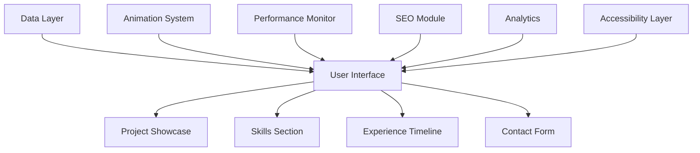

# Portfolio Website

A professional portfolio website designed to showcase web development capabilities, projects, and skills through an elegant and interactive user interface.

## Overview

This portfolio website serves as a comprehensive demonstration of web development skills, featuring modern design principles, responsive layouts, and interactive elements that highlight technical expertise and project accomplishments.

## Key Features

### Design & User Experience
- **Responsive Design**: Seamlessly adapts to desktop, tablet, and mobile devices
- **Modern UI/UX**: Clean, professional interface with smooth animations
- **Interactive Elements**: Hover effects, transitions, and micro-interactions
- **Performance Optimized**: Fast loading times and smooth scrolling
- **Accessibility**: WCAG compliance and keyboard navigation support

### Content Showcase
- **Project Gallery**: Dynamic project cards with detailed information
- **Skill Display**: Visual representation of technical competencies
- **Experience Timeline**: Professional journey and achievements
- **Contact Forms**: Integrated communication channels
- **Social Links**: Professional network connections

### Technical Implementation
- **Semantic HTML5**: Proper document structure and SEO
- **Modern CSS3**: Advanced styling with animations and gradients
- **Vanilla JavaScript**: Framework-independent functionality
- **Progressive Enhancement**: Graceful degradation for older browsers
- **SEO Optimized**: Meta tags, structured data, and sitemaps

## Technology Stack

### Frontend Technologies
- **HTML5**: Semantic markup, accessibility features
- **CSS3**: Flexbox, Grid, animations, custom properties
- **JavaScript**: ES6+, DOM manipulation, event handling
- **Web APIs**: LocalStorage, Intersection Observer, Fetch API

### Design & Styling
- **CSS Framework**: Custom utility classes and components
- **Animation Libraries**: CSS animations and JavaScript transitions
- **Icon Libraries**: Font Awesome or custom SVG icons
- **Typography**: Web fonts and responsive text scaling

### Performance & Optimization
- **Image Optimization**: Lazy loading, modern formats (WebP)
- **Code Minification**: Optimized CSS and JavaScript
- **Caching Strategy**: Browser caching and service workers
- **Bundle Optimization**: Efficient asset delivery

## Architecture Overview



## Project Structure

### File Organization
```
portfolio-website/
├── index.html              # Main portfolio page
├── css/
│   ├── style.css          # Main stylesheet
│   ├── components.css      # Component styles
│   └── responsive.css     # Mobile-first responsive rules
├── js/
│   ├── main.js            # Main application logic
│   ├── projects.js        # Project management
│   ├── animations.js       # Animation system
│   └── utils.js           # Utility functions
├── assets/
│   ├── images/            # Project images and icons
│   ├── fonts/             # Custom web fonts
│   └── icons/             # SVG icons and favicons
├── data/
│   └── projects.json      # Project data (optional)
└── pages/
    ├── about.html          # About page
    ├── contact.html        # Contact page
    └── resume.html         # Resume/CV page
```

## Installation & Setup

### Quick Start

1. **Download Repository**
   ```bash
   git clone https://github.com/yourusername/portfolio-website.git
   cd portfolio-website
   ```

2. **Local Development**
   ```bash
   # Using Python 3
   python -m http.server 8000
   
   # Using Node.js
   npx serve .
   
   # Using PHP
   php -S localhost:8000
   ```

3. **Open in Browser**
   ```bash
   # Navigate to http://localhost:8000
   open http://localhost:8000
   ```

### Configuration

#### Basic Setup
- **Personal Information**: Update name, title, and contact details
- **Project Data**: Add your projects to the data section
- **Styling**: Customize colors, fonts, and layout
- **SEO Settings**: Configure meta tags and descriptions

#### Advanced Configuration
- **Analytics Integration**: Google Analytics or other tracking
- **Contact Forms**: Form submission endpoints
- **Social Media**: Update social profile links
- **Custom Domain**: Configure for production deployment

## Features in Detail

### Project Showcase

#### Project Cards
- **Thumbnail Images**: Visual project representation
- **Technology Tags**: Framework and language indicators
- **Project Descriptions**: Brief overviews with "Read More" links
- **Live Demos**: Direct links to deployed applications
- **Source Code**: GitHub repository links

#### Project Details
- **Full Descriptions**: Comprehensive project information
- **Image Galleries**: Multiple screenshots and visuals
- **Technical Details**: Architecture and implementation notes
- **Challenges & Solutions**: Problem-solving demonstrations
- **Results & Impact**: Project outcomes and achievements

### Skills & Expertise

#### Technical Skills
- **Programming Languages**: JavaScript, Python, HTML, CSS
- **Frameworks & Libraries**: React, Vue, Node.js, Express
- **Tools & Platforms**: Git, Docker, AWS, Vercel
- **Design Skills**: UI/UX, responsive design, accessibility

#### Skill Visualization
- **Progress Bars**: Visual skill level representation
- **Category Grouping**: Organized by technology type
- **Experience Indicators**: Years of experience or project count
- **Interactive Elements**: Hover effects and tooltips

### Experience Timeline

#### Professional Journey
- **Chronological Display**: Career progression timeline
- **Company Information**: Employment history and roles
- **Achievement Highlights**: Key accomplishments and milestones
- **Skill Development**: Growth and learning progression

#### Education & Certifications
- **Academic Background**: Degrees and institutions
- **Professional Certifications**: Industry-recognized credentials
- **Continuous Learning**: Courses, workshops, and self-study
- **Knowledge Areas**: Areas of expertise and specialization

## Performance Optimization

### Loading Performance
- **Lazy Loading**: Images and content loaded on demand
- **Code Splitting**: JavaScript modules loaded when needed
- **Minification**: Compressed CSS and JavaScript files
- **Image Optimization**: WebP format and responsive images
- **CDN Integration**: Fast asset delivery

### Runtime Performance
- **Efficient DOM Manipulation**: Optimized JavaScript operations
- **Event Delegation**: Reduced event listeners
- **Animation Optimization**: Hardware-accelerated CSS animations
- **Memory Management**: Proper cleanup and garbage collection
- **Smooth Scrolling**: Optimized scroll performance

## SEO & Accessibility

### Search Engine Optimization
- **Meta Tags**: Title, description, keywords
- **Structured Data**: JSON-LD for rich snippets
- **Semantic HTML**: Proper heading hierarchy and landmarks
- **Sitemap.xml**: Search engine discovery
- **Robots.txt**: Crawler instructions

### Web Accessibility
- **Keyboard Navigation**: Full keyboard accessibility
- **Screen Reader Support**: ARIA labels and roles
- **Color Contrast**: WCAG AA compliance
- **Focus Management**: Visible focus indicators
- **Alt Text**: Descriptive image alternatives

## Deployment Options

### Static Hosting

#### GitHub Pages
```bash
# Deploy to GitHub Pages
git add .
git commit -m "Deploy portfolio"
git push origin main

# Enable Pages in repository settings
# Configure custom domain if needed
```

#### Netlify
```bash
# Deploy to Netlify
# Connect repository in Netlify dashboard
# Configure build settings (if needed)
# Deploy automatically on push
```

#### Vercel
```bash
# Deploy to Vercel
vercel --prod
# or connect repository in Vercel dashboard
```

### Custom Deployment
- **Shared Hosting**: Traditional web hosting with FTP
- **VPS Hosting**: Custom server configuration
- **Cloud Platforms**: AWS S3, Google Cloud, Azure
- **CDN Integration**: CloudFlare, Fastly

## Customization Guide

### Visual Customization

#### Color Scheme
```css
:root {
  --primary-color: #2563eb;
  --secondary-color: #64748b;
  --accent-color: #3b82f6;
  --background-color: #ffffff;
  --text-color: #1f2937;
  --light-gray: #f3f4f6;
  --dark-gray: #374151;
}
```

#### Typography
```css
/* Font imports */
@import url('https://fonts.googleapis.com/css2?family=Inter:wght@300;400;500;600;700&display=swap');

/* Font variables */
:root {
  --font-primary: 'Inter', sans-serif;
  --font-mono: 'Fira Code', monospace;
  --font-size-base: 16px;
  --line-height-base: 1.6;
}
```

### Content Customization

#### Adding Projects
```json
{
  "id": "project-unique-id",
  "title": "Amazing Web Application",
  "description": "A comprehensive web application that solves real-world problems",
  "technologies": ["React", "Node.js", "MongoDB"],
  "liveUrl": "https://project-demo.com",
  "githubUrl": "https://github.com/username/project",
  "imageUrl": "/assets/images/project-thumb.jpg",
  "featured": true,
  "date": "2024-01-15"
}
```

#### Updating Skills
```javascript
const skills = [
  {
    "name": "JavaScript",
    "level": 90,
    "category": "Programming",
    "years": 5
  },
  {
    "name": "React",
    "level": 85,
    "category": "Frameworks",
    "years": 3
  }
];
```

## Maintenance & Updates

### Content Updates
- **Project Addition**: Regularly add new completed projects
- **Skill Updates**: Keep technical skills current
- **Experience Timeline**: Update professional achievements
- **Blog Integration**: Add thoughts and insights (optional)
- **Contact Information**: Maintain current contact details

### Technical Maintenance
- **Dependency Updates**: Keep libraries and frameworks current
- **Security Updates**: Regular security patches and reviews
- **Performance Monitoring**: Track loading times and user experience
- **Backup Strategy**: Regular code and content backups
- **Browser Testing**: Ensure cross-browser compatibility

## Analytics & Monitoring

### User Analytics
- **Google Analytics**: Traffic and user behavior tracking
- **Hotjar**: User session recordings and heatmaps
- **Performance Monitoring**: Core Web Vitals and page speed
- **Error Tracking**: JavaScript error monitoring and reporting
- **A/B Testing**: Design and feature optimization

### SEO Monitoring
- **Google Search Console**: Search performance and indexing
- **PageSpeed Insights**: Performance optimization recommendations
- **Mobile-Friendly Test**: Mobile usability verification
- **Structured Data Testing**: Rich snippet validation
- **Backlink Monitoring**: Domain authority and link tracking

## Troubleshooting

### Common Issues

#### Styling Problems
- **CSS Not Loading**: Verify file paths and server configuration
- **Responsive Issues**: Check viewport meta tag and media queries
- **Animation Performance**: Optimize complex animations
- **Font Loading**: Verify font imports and fallbacks

#### JavaScript Errors
- **Console Errors**: Check browser developer tools
- **Event Listeners**: Ensure proper cleanup and delegation
- **Async Operations**: Handle promises and errors correctly
- **Browser Compatibility**: Test across different browsers

#### Performance Issues
- **Slow Loading**: Optimize images and minify code
- **Large Bundle Size**: Implement code splitting
- **Memory Leaks**: Check for unclosed event listeners
- **Animation Jank**: Use CSS transforms and opacity

## Future Enhancements

### Planned Features
- **Content Management System**: Dynamic content updates
- **Blog Integration**: Articles and tutorials section
- **Dark Mode**: Theme switching capability
- **Advanced Animations**: Scroll-triggered animations
- **Multi-language Support**: Internationalization
- **Progressive Web App**: Offline functionality

### Technical Improvements
- **TypeScript Migration**: Type safety and better development
- **Framework Integration**: React or Vue.js adoption
- **Testing Suite**: Automated testing implementation
- **CI/CD Pipeline**: Automated deployment and testing
- **Performance Monitoring**: Real-time performance tracking

## Contributing

### Development Workflow
1. **Fork Repository**: Create development copy
2. **Feature Branch**: `git checkout -b feature-name`
3. **Implement Changes**: Add features or fix issues
4. **Test Thoroughly**: Ensure cross-browser compatibility
5. **Pull Request**: Submit changes for review

### Code Standards
- **Clean Code**: Well-structured and documented code
- **Performance**: Optimized and efficient implementations
- **Accessibility**: WCAG compliance throughout
- **SEO Best Practices**: Semantic and optimized markup
- **Responsive Design**: Mobile-first development approach

## License & Support

### License
This project is licensed under the MIT License - see the [LICENSE](../../../LICENSE) file for complete details.

### Support & Contact
- **Documentation**: Comprehensive setup and usage guides
- **Issues**: Report bugs and request features via GitHub
- **Community**: Join discussions and contribute to improvements
- **Professional**: Connect via portfolio contact form

---

This portfolio website represents a comprehensive demonstration of modern web development capabilities, combining elegant design with robust technical implementation and best practices.
